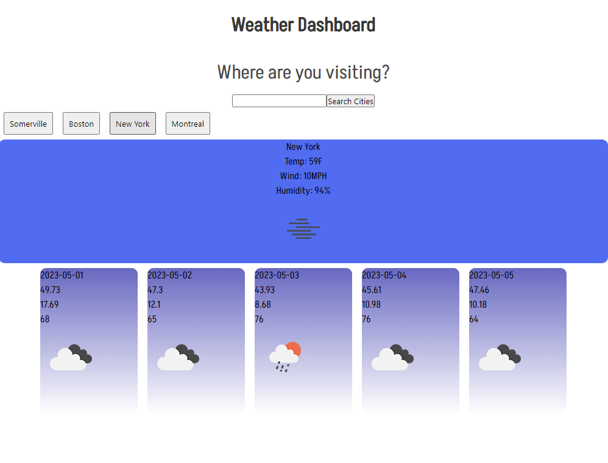

# Weather Dashboard

## Overview

This application is intended for travelers to be able to view the local weather and five-day forecast of a given city. Users may type a particular city into the search bar and are presented with both today's weather and a five-day forecast. The application also keeps a user's history visible as buttons in case they intend to revisit a particular city and are in need of the forecast.  

## Technologies

This application uses HTML, CSS, Javscript and the Bulma framework. 